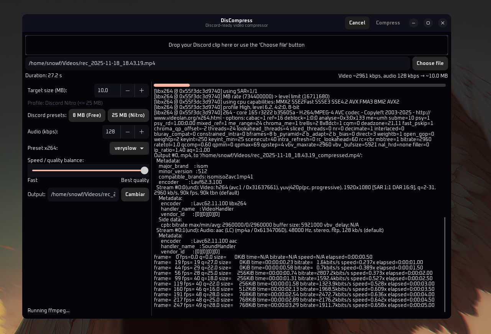

# DisCompress

DisCompress is a GTK3 desktop app that makes it easy to compress videos for Discord.
It is a thin, dark-themed frontend around `ffmpeg` + `ffprobe`, with Discord-specific
size presets and live progress.

## Features

- Drag & drop a video directly onto the window.
- Discord size presets: **8 MB (Free)** and **25 MB (Nitro)**.
- Automatic bitrate calculation from desired size (MB) and real duration.
- x264 preset selector + visual speed/quality slider.
- Live `ffmpeg` log in a dark, Discord-like theme.
- Progress bar based on the `time=` field from `ffmpeg` output.
- Clear completion dialog with the exact output path.
- Cancel button to stop an ongoing encode.

## Requirements

- Python 3
- PyGObject + GTK3 (e.g. `python3-gi`, `gir1.2-gtk-3.0` depending on your distro)
- `ffmpeg` and `ffprobe` installed and available in `PATH`

Example on Debian/Ubuntu-based systems:

```bash
sudo apt install python3-gi gir1.2-gtk-3.0 ffmpeg
```

Example on Arch Linux (pacman):

```bash
sudo pacman -S python-gobject gtk3 ffmpeg
```

Example on Fedora (dnf):

```bash
sudo dnf install python3-gobject gtk3 ffmpeg
```

On other distributions, install the PyGObject/GTK3 bindings for Python 3 and ffmpeg/ffprobe
from your package manager using equivalent package names.

## Run

```bash
git clone https://github.com/snowarch/DisCompress.git
cd DisCompress
python3 main.py
```

## Usage

1. Start **DisCompress**.
2. Drag a video onto the drop area, or click **"Choose file"** and pick one.
3. Adjust:
   - **Target size (MB)**, or use one of the **Discord presets**.
   - **Audio (kbps)**.
   - x264 **Preset** and the **Speed / quality** slider.
4. Optionally change the output path.
5. Click **Compress**.

You will see:

- A live `ffmpeg` log.
- A percentage-based progress bar.
- A final dialog showing exactly where the compressed file was saved.

## Screenshot



## License

MIT. See the `LICENSE` file.
